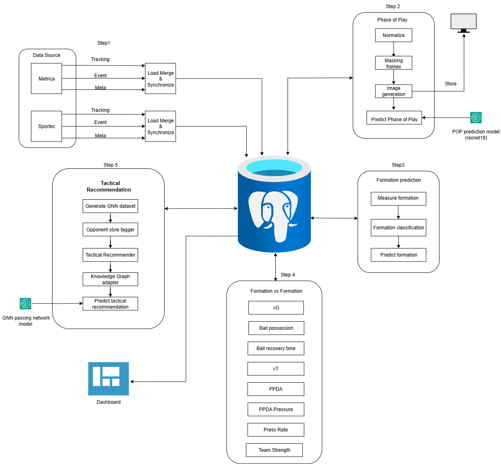
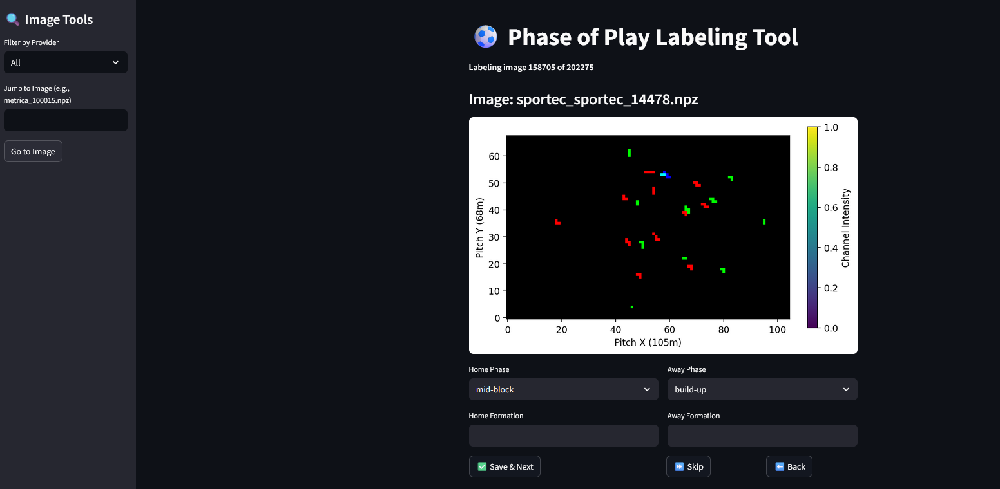
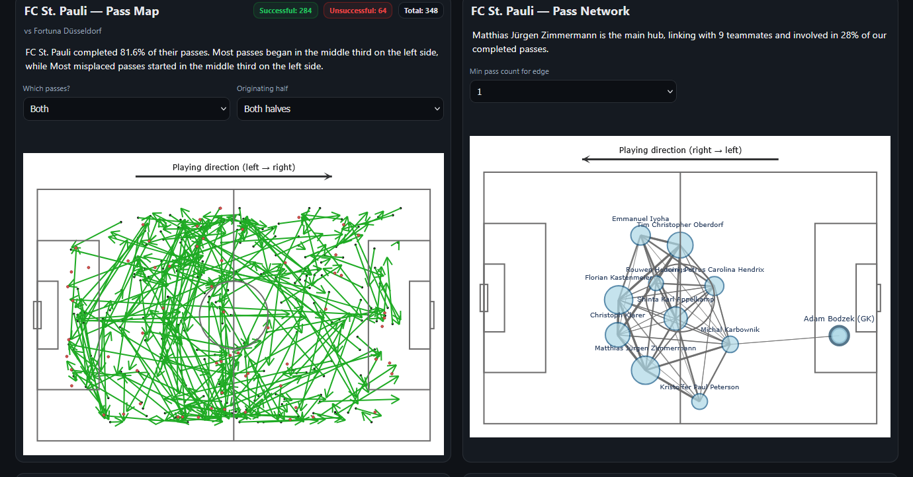
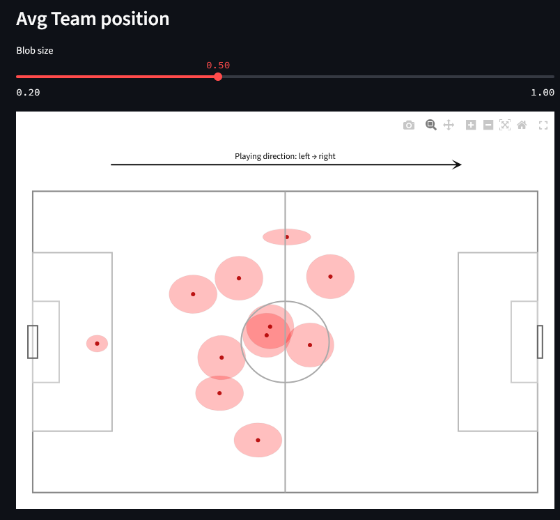
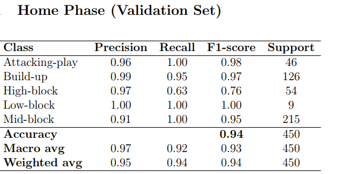
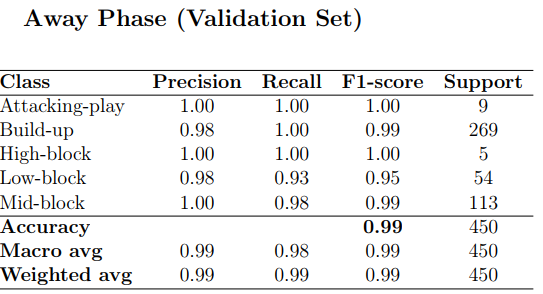
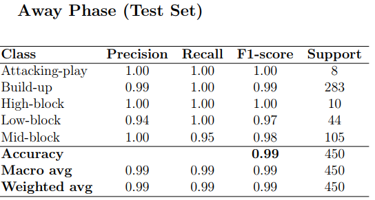
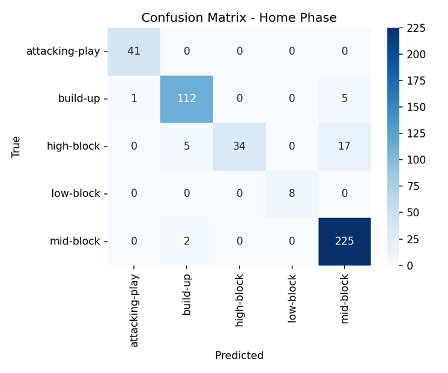
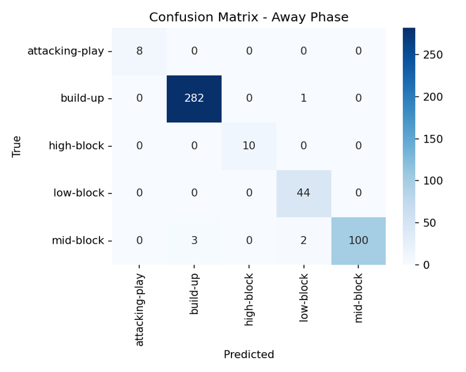

# ⚽ Deep Learning-based Formation Detection and GNN-driven Tactical Decision Support System for Football Analytics

This repository contains the full implementation of my **Master’s Thesis** project, which presents an end-to-end AI-driven football analytics framework.  
The system integrates **machine learning**, and **graph neural networks (GNNs)** to analyze team formations, tactical phases, and recommend counter-formations using synchronized **tracking** and **event** data.

---

## 📘 Overview
The goal of this project is to build a **data-driven tactical analysis system** that automatically:
1. Detects **phases of play** and **team formations** from raw positional data.  
2. Quantifies **formation-vs-formation performance** using engineered tactical metrics.  
3. Generates **counter-formation recommendations** through a **GNN + Knowledge Graph** pipeline.  
4. Visualizes insights through an **interactive Flask dashboard**.

---

## 🗂️ Dataset and Data Sources
The project uses **multi-provider tracking, event and meta data** from:
- **Sportec** 7 matches and **Metrica Sports** 1 sample match datasets  
- Tracking data (x, y coordinates of players and ball, 25Hz)
- Event data (passes, shots, tackles, interceptions, etc.)
- Meta data( stadium name, weather, stadium Id, etc)

Data ingestion and synchronization are handled using:
- [**DataBallPy**](https://github.com/Alek050/databallpy)
- [**Kloppy**](https://github.com/PySport/kloppy)

---

## 🧠 System Overview
The complete pipeline from data ingestion to dashboard is shown below:

## 🏗️ System Architecture
### 1. **Data Ingestion & Preprocessing**
- Loaded and synchronized Sportec and Metrica tracking + event data using **DataBallPy** and **Kloppy**.  
- Normalized coordinates, harmonized schemas, and computed **eligibility flags** to filter unstable phases (set pieces, transitions).  
- Stored cleaned data in **PostgreSQL** for reproducibility.  

**Tools:** `Python`, `DataBallPy`, `Kloppy`, `Pandas`, `PostgreSQL`

---

### 2. **Phase of Play Classifier**
- Built a **multi-task CNN (ResNet-18)** to classify each frame into tactical phases:  
  *build-up, attack, high block, mid block, low block*  
- Input: 13-frame sliding windows converted into **105×68 image grids** with 3 channels (home, away, ball).  
- Annotated 5,000 frames using a **custom Streamlit labeling app**.  
- Output stored in DB columns: `phase_home_pred`, `phase_away_pred`.

**Tools:** `PyTorch`, `Torchvision`, `Streamlit`, `NumPy`, `Pandas`

---

### 3. **Formation Detection Layer**
- Extracted stable blocks (≥45s) based on positional consistency.
- Computed **Gaussian templates** (mean, covariance) per player role.
- Applied **Shaw ordering** to standardize left-to-right alignment.
- Compared formations via **Wasserstein-2 distance** and **Hungarian matching**, clustered with **Agglomerative Clustering**.
- Used CNN fallback for uncertain cases.  
- Stored canonical templates in `formation_templates_shaw`.

**Tools:** `Scikit-learn`, `NumPy`, `SciPy`, `PostgreSQL`

---

### 4. **Formation-vs-Formation Analysis**
- For every overlapping formation pair, computed tactical metrics:
  - **xG** (expected goals)
  - **xT** (expected threat)
  - **Possession %**
  - **PPDA**, **Pressing Rate**, **Width**, **Depth**, **Stretch**, **Recovery Time**
- Normalized metrics and derived composite **Team Strength Scores** (`home_strength_eq`, `away_strength_eq`).
- Stored aggregated results in `formation_vs_formation_new`.

**Tools:** `Scikit-learn`, `NumPy`, `Pandas`

---

### 5. **Tactical Recommendation Layer**
- Constructed **team-phase passing graphs** (players = nodes, passes = edges).
- Trained a **Graph Neural Network (GNN)** with **GATv2Conv layers** to predict optimal counter-formations.
- Combined signals from:
  - **GNN predictions**
  - **Knowledge Graph (COUNTERS, EXHIBITS edges)**
  - **Formation-vs-Formation priors**
- Generated explainable recommendations with **confidence scores** and **coaching notes** (e.g., “exploit width vs compact block”).

**Tools:** `PyTorch Geometric`, `NetworkX`, `PostgreSQL`, `NumPy`

---

### 6. **Dashboard and Visualization**
- Developed an interactive **Flask + Plotly** web dashboard:
  - **Pass Map** with success filters  
  - **Pass Network** with edge weighting  
  - **Average Player Positions**  
  - **Formation Timeline Visualization**  
  - **Tactical Recommendations Panel**  
- User uploads match files → system runs full pipeline → outputs visualization & suggestions.

**Tools:** `Flask`, `Plotly`, `SQLAlchemy`, `HTML/CSS`, `Matplotlib`

---

### **Evaluation**
The system’s **phase classification models** (ResNet-18) were evaluated on both **home** and **away** teams using confusion matrices.  
The results demonstrate strong performance, particularly for structured phases such as *build-up* and *mid-block*.

**Observations**
- The **Home Phase model** achieved **~93.3% accuracy**, showing high precision for *mid-block* and *attacking-play* phases.  
- The **Away Phase model** achieved **~98.6% accuracy**, with excellent class separation and minimal cross-phase confusion.  
- Minor overlap between *mid-block* and *low-block* reflects natural tactical fluidity.  
- Overall, the model generalizes well across both teams, validating the CNN’s ability to capture spatial–temporal dynamics from tracking data.

**Metrics:** Accuracy, Precision, Recall, F1-Score, Confusion Matrix Visualization

  
  

  
  

  
  

These results confirm that the ResNet-18 based classifier effectively distinguishes tactical phases, providing a reliable foundation for downstream formation and GNN-based tactical recommendation layers.

## 🏁 Conclusion

This project presented an end-to-end **Deep Learning-based Formation Detection and GNN-driven Tactical Decision Support System** for football analytics.  
By integrating tracking and event data across multiple providers (Sportec, PFF, and Metrica), the system enables automated tactical understanding at both the **phase** and **formation** levels.

The **ResNet-18–based phase classifier** achieved high accuracy across multiple game states, while the **Formation vs Formation** analysis layer quantified tactical matchups using metrics such as xG, possession percentage, and ball recovery time.  
The **GNN-based Tactical Recommender** built on these insights to propose interpretable, data-driven tactical adjustments.

A key advancement of this work lies in the incorporation of a **Knowledge Graph (KG)** layer that models relationships between teams, formations, and tactical outcomes.  
By linking graph-based reasoning with statistical evidence, the KG enables **explainable tactical recommendations**, showing *why* a specific counter-strategy is suggested—rather than treating the model as a black box.

Key contributions include:
- A **unified data ingestion pipeline** for multi-provider football datasets.  
- A **CNN-based classifier** for recognizing phases of play with high generalization.  
- A **Formation vs Formation layer** quantifying contextual team interactions.  
- A **GNN + Knowledge Graph–driven recommender system** providing explainable tactical insights.  
- A **visual analytics dashboard** integrating all layers for real-world usability.

Overall, this system demonstrates how deep learning, graph reasoning, and structured knowledge representation can bridge the gap between **raw tracking data and tactical intelligence**, advancing the field of modern football analytics toward **interpretable AI-assisted coaching**.

---
